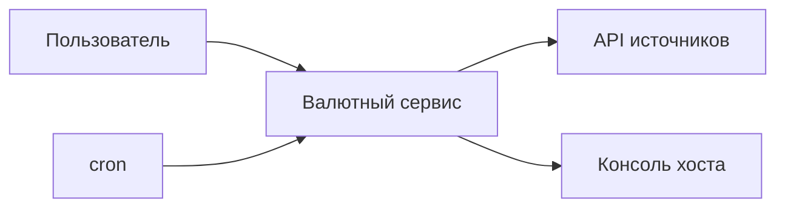
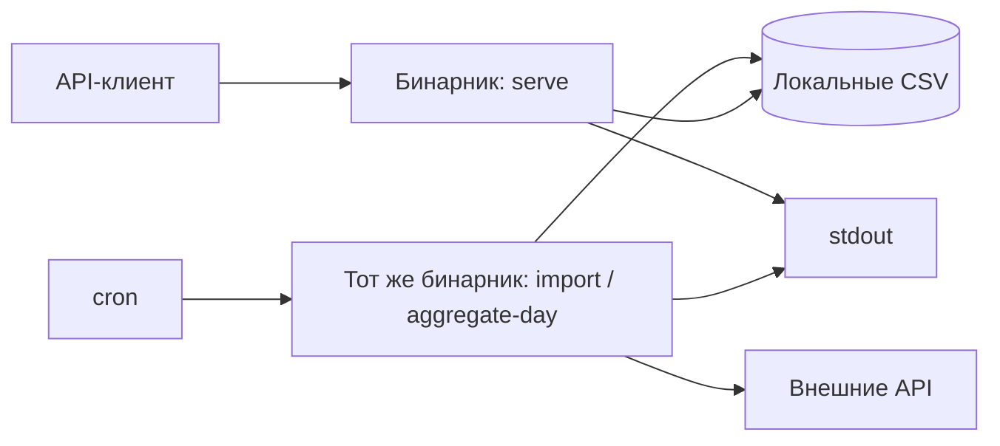
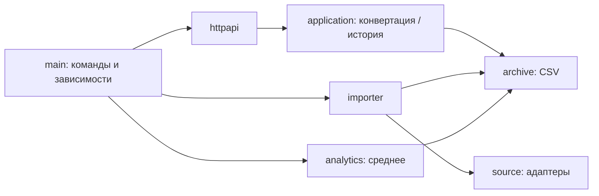
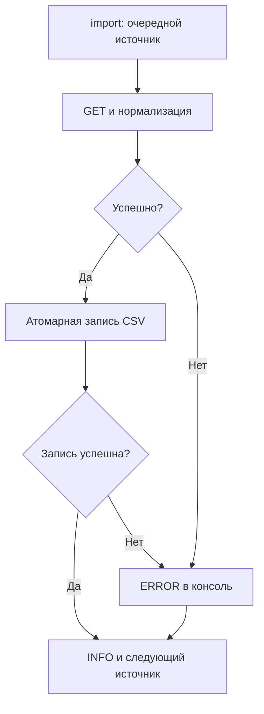

# Архитектура сервиса

Пакеты появляются по мере выполнения [шести задач](tasks/README.md). Один бинарник и хост, последовательная обработка источников, локальные CSV.

Команды: `calculate` — расчёт по заданному курсу, `import` — сбор, `convert` — выбор предложения из CSV, `serve` — HTTP, `aggregate-day` — дневное среднее. Первые две задачи не требуют сети.

## C1 — контекст

## C2 — процессы и хранение

## C3 — обязанности компонентов

`domain` — типы и арифметика; `config` — настройки; `logging` создаёт один slog.Logger в main. Нижние слои возвращают ошибки, importer / aggregate-day / HTTP handler пишут их один раз в консоль.

## Потоки

Конвертация: параметры → последние записи каждого ключа → фильтр свежести и канала → сортировка → сумма. История: закрытый день → группы направленных курсов → средние → daily CSV → HTTP history.

Политика ошибок и формат CSV — в [документе 04](04-data-and-operations.md), средние — в [документе 05](05-analytics.md). Целевые деревья приведены в конце каждой карточки; сразу создавать все пакеты не требуется.
