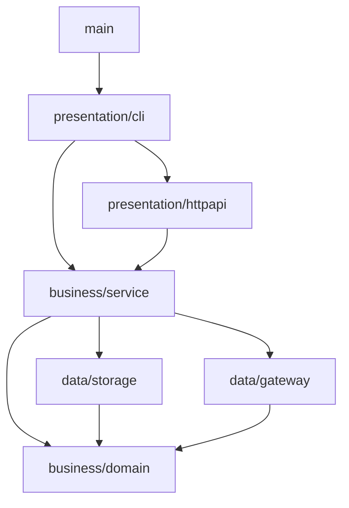

# Вариант 1. Классическая трёхслойная архитектура + DDD

Документ для обсуждения. Постановки задач он не меняет. Сравнение с другими вариантами: [гексагональная](02-hexagonal.md), [package by feature](03-package-by-feature.md).

## Идея

Код делится на три горизонтальных слоя. Каждый слой вызывает только нижележащий:

```text
presentation  →  business  →  data
(CLI, HTTP)      (сервисы       (CSV-хранилище,
                  + домен)       внешние API)
```

DDD здесь применяется внутри слоя `business`. Он делится на `service` (прикладные сценарии) и `domain` (модель и правила). Получается сжатая версия слоёв Эванса: application и domain объединены в один бизнес-слой.

Главное отличие от гексагонального варианта: **интерфейсы хранилищ и шлюзов объявляет слой `data`**, а `service` импортирует пакеты `data` напрямую. Зависимость направлена «сверху вниз» к технике, а не к домену.

## Модель предметной области

| Пакет | Что моделирует | Основные типы |
|---|---|---|
| `domain/money` | деньги и курс | `Currency`, `Amount`, `Rate`, `Pair` (value objects, валидация в конструкторе) |
| `domain/rate` | наблюдение курса | `Quote` (нормализованная запись, бывший `RateRecord`), `Snapshot` (агрегат: одно получение одного источника), `SourceID`, `Kind`, `Channel`, `City`, `Key` |
| `domain/rate` | правила выбора | `LatestByKey`, `Fresh`, `BestOffers`, `Convert(amount, quote, direction)` (доменный сервис) |
| `domain/history` | дневная история | `Day` (дата Europe/Moscow), `DailyAverage` (агрегат), `GroupKey`, `Aggregate` |

Инварианты живут в конструкторах домена, а не в парсере каждого банка. Например: `kind=reference` означает, что нет buy/sell; банковская запись обязана иметь buy или sell; курс строго больше нуля.

## Итоговая структура (после задачи 006)

```text
tanya-solution/
├── cmd/currency-service/
│   └── main.go                     # сборка зависимостей и запуск presentation/cli
├── internal/
│   ├── presentation/               # СЛОЙ 1: вход в программу
│   │   ├── cli/
│   │   │   ├── router.go           # os.Args → команда
│   │   │   ├── calculate.go        # 001
│   │   │   ├── import.go           # 003–004: вызывает service, пишет INFO/WARN/ERROR по источникам
│   │   │   ├── convert.go          # 004
│   │   │   ├── aggregate_day.go    # 006
│   │   │   └── serve.go            # 005: поднимает httpapi
│   │   └── httpapi/
│   │       ├── server.go           # http.ServeMux, HTTP_ADDR
│   │       ├── convert.go          # GET /v1/convert
│   │       ├── best.go             # GET /v1/rates/best
│   │       ├── history.go          # GET /v1/rates/history
│   │       ├── health.go           # GET /healthz
│   │       ├── dto.go              # JSON-формы запросов и ответов, decimal строкой
│   │       └── errors.go           # service-ошибки → 400/404/500, один ERROR на 500
│   │
│   ├── business/                   # СЛОЙ 2: бизнес-логика
│   │   ├── domain/                 # ядро DDD, импортирует только stdlib и decimal
│   │   │   ├── money/
│   │   │   │   ├── currency.go
│   │   │   │   ├── amount.go
│   │   │   │   ├── rate.go         # Rate, Invert() для 1/sell
│   │   │   │   ├── pair.go
│   │   │   │   └── parse.go        # разбор decimal (бывший ParsePositiveDecimal)
│   │   │   ├── rate/
│   │   │   │   ├── quote.go
│   │   │   │   ├── snapshot.go
│   │   │   │   ├── source_id.go
│   │   │   │   ├── kind.go
│   │   │   │   ├── channel.go
│   │   │   │   ├── city.go
│   │   │   │   ├── key.go
│   │   │   │   ├── selection.go    # LatestByKey, Fresh, BestOffers
│   │   │   │   ├── conversion.go
│   │   │   │   └── errors.go
│   │   │   └── history/
│   │   │       ├── day.go
│   │   │       ├── daily_average.go
│   │   │       └── aggregate.go    # чистая функция: Day + []Quote → []DailyAverage
│   │   └── service/                # прикладные сценарии (use cases)
│   │       ├── calculate.go
│   │       ├── import.go           # ImportService: цикл по шлюзам, backoff, сохранение снимков
│   │       ├── convert.go          # ConvertService: Convert, Best
│   │       ├── history.go          # HistoryService: AggregateDay, History
│   │       └── errors.go           # ErrInvalidInput, ErrNoOffer, ErrNotFound, ErrDayNotClosed
│   │
│   ├── data/                       # СЛОЙ 3: доступ к данным
│   │   ├── storage/
│   │   │   ├── storage.go          # интерфейсы SnapshotRepository, DailyRepository, BackoffRepository
│   │   │   ├── atomic.go           # tmp → Flush → Sync → Close → rename
│   │   │   ├── snapshot_csv.go     # data/archive/YYYY-MM-DD/<source>-<ts>.csv
│   │   │   ├── daily_csv.go        # data/daily/YYYY-MM-DD.csv
│   │   │   └── backoff_file.go     # data/backoff/<source>.txt
│   │   └── gateway/                # внешние API источников
│   │       ├── gateway.go          # интерфейс RateGateway: ID(), Fetch(ctx) ([]rate.Quote, error)
│   │       ├── registry.go         # SOURCES: ID → конструктор
│   │       ├── transport.go        # HTTP GET 5 с / чтение файла, HTTPError{Status, RetryAfter}
│   │       ├── cbr_xml.go
│   │       ├── cbr_json.go
│   │       ├── moex.go
│   │       ├── tbank.go
│   │       ├── raiffeisen.go
│   │       └── testdata/           # сохранённые ответы для тестов разбора
│   │
│   └── platform/                   # сквозная техника, не слой
│       ├── config/config.go        # DATA_DIR, SOURCES, LOG_LEVEL, HTTP_ADDR
│       └── logging/logger.go
├── data/                           # в .gitignore
│   ├── archive/
│   ├── daily/
│   └── backoff/
├── data-demo/                      # в .gitignore, demo-cbr, demo-bank-a/b
├── crontab.example
└── README.md
```

## Зависимости



Правила:

- `presentation` не импортирует `data`. HTTP и CLI работают только через `service`.
- `domain` не импортирует ничего из проекта.
- `data` возвращает доменные типы (`rate.Quote`, `rate.Snapshot`), а не собственные структуры CSV или JSON.
- Логирование ошибок выполняется один раз, на границе операции: `cli/import.go`, `cli/aggregate_day.go`, `httpapi/errors.go`. `service` возвращает ошибки или отчёт.

## Ключевые решения

**Сервис импорта возвращает отчёт, логирует его presentation.**

```go
// business/service/import.go
type SourceResult struct {
	Source   rate.SourceID
	Records  int
	Skipped  bool // действует Retry-After
	Err      error
	Duration time.Duration
}

type ImportService struct {
	Gateways  []gateway.RateGateway    // интерфейс из data
	Snapshots storage.SnapshotRepository
	Backoff   storage.BackoffRepository
	Now       func() time.Time
}

func (s ImportService) Run(ctx context.Context) []SourceResult
```

**Шлюз разделён на транспорт и чистую функцию разбора.** Поэтому `import --input` использует тот же разбор, что и HTTP.

```go
// data/gateway/cbr_xml.go
func (g *CBRXML) Fetch(ctx context.Context) ([]rate.Quote, error) {
	rc, err := g.open(ctx) // HTTP или файл
	if err != nil {
		return nil, err
	}
	defer rc.Close()
	return parseCBRXML(rc, g.id, g.now())
}
```

## Типовые изменения

| Изменение | Что затрагивается |
|---|---|
| Новый источник | `data/gateway/<name>.go`, `testdata/`, строка в `registry.go` |
| Хранилище вместо CSV | новые реализации в `data/storage`; `service` при этом не меняется, пока сохраняется интерфейс |
| Новое правило выбора | `domain/rate/selection.go` + тест |
| Новый эндпоинт | `presentation/httpapi/<name>.go` + метод сервиса |

## Состояние после задачи 004

К этому моменту есть команды `calculate`, `import` (5 источников, Retry-After) и `convert`. HTTP, дневной истории и cron ещё нет.

```text
tanya-solution/
├── cmd/currency-service/main.go
├── internal/
│   ├── presentation/
│   │   └── cli/
│   │       ├── router.go
│   │       ├── calculate.go
│   │       ├── import.go           # --input → demo-cbr, DATA_DIR=./data-demo
│   │       └── convert.go          # --from --to --amount --channel [--city Moscow]
│   ├── business/
│   │   ├── domain/
│   │   │   ├── money/
│   │   │   │   ├── currency.go
│   │   │   │   ├── amount.go
│   │   │   │   ├── rate.go
│   │   │   │   ├── pair.go
│   │   │   │   └── parse.go
│   │   │   └── rate/
│   │   │       ├── quote.go
│   │   │       ├── snapshot.go
│   │   │       ├── source_id.go
│   │   │       ├── kind.go         # reference, market_reference, bank
│   │   │       ├── channel.go      # cash, account
│   │   │       ├── city.go         # Moscow, unknown
│   │   │       ├── key.go
│   │   │       ├── selection.go    # LatestByKey, Fresh, BestOffers
│   │   │       ├── conversion.go   # buy или 1/sell
│   │   │       └── errors.go
│   │   └── service/
│   │       ├── calculate.go
│   │       ├── import.go
│   │       ├── convert.go
│   │       └── errors.go
│   ├── data/
│   │   ├── storage/
│   │   │   ├── storage.go          # SnapshotRepository, BackoffRepository
│   │   │   ├── atomic.go
│   │   │   ├── snapshot_csv.go     # Save, Read, Since (последние записи по ключу)
│   │   │   └── backoff_file.go
│   │   └── gateway/
│   │       ├── gateway.go
│   │       ├── registry.go
│   │       ├── transport.go
│   │       ├── cbr_xml.go
│   │       ├── cbr_json.go
│   │       ├── moex.go
│   │       ├── tbank.go
│   │       ├── raiffeisen.go
│   │       └── testdata/
│   └── platform/
│       ├── config/config.go        # DATA_DIR, SOURCES, LOG_LEVEL
│       └── logging/logger.go
├── data/archive/
└── data-demo/archive/              # demo-cbr, demo-bank-a, demo-bank-b
```

Ещё не появились: `presentation/httpapi/`, `domain/history/`, `service/history.go`, `storage/daily_csv.go`, `data/daily/`, `crontab.example`.

### Переезд из текущего `main`

| Сейчас | После 004 |
|---|---|
| `cmd/currency-service/main.go` (разбор команд + логика) | `main.go` (сборка) + `presentation/cli/*` |
| `internal/domain/conversion.go` | `domain/money/*` (разбор, умножение) + `service/calculate.go` |
| `internal/importer/importer.go`, `RateRecord` | `service/import.go` + `domain/rate/quote.go` |
| нормализация ЦБ в importer | `data/gateway/cbr_xml.go` |
| `internal/source/cbr_xml.go` | `data/gateway/cbr_xml.go` + `transport.go` |
| `internal/archive/csv.go` | `data/storage/snapshot_csv.go` + `atomic.go` |
| `internal/config`, `internal/logging` | `platform/config`, `platform/logging` |

## Плюсы и минусы

- Самый привычный вариант, легко объяснить и найти, где что лежит.
- Слоёв мало, и нет абстракций «ради абстракций».
- `service` зависит от пакетов `data`. Для тестов сервиса нужны фейки интерфейсов из `data`, а смена хранилища требует сохранить его контракт.
- С ростом числа сценариев `service` превращается в большую папку, где рядом лежат несвязанные фичи.
