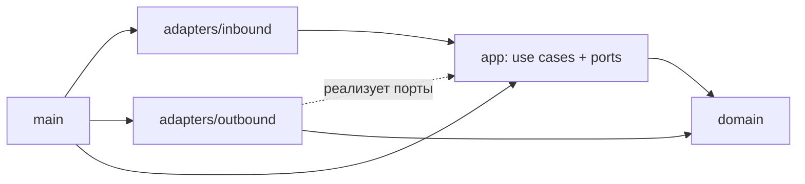

# Вариант 2. Гексагональная архитектура (ports & adapters) + DDD

Документ для обсуждения. Постановки задач он не меняет. Сравнение с другими вариантами: [трёхслойная](01-three-layer.md), [package by feature](03-package-by-feature.md).

## Идея

В центре находятся домен и прикладные сценарии. Всё внешнее подключается через **порты**, то есть интерфейсы, которые объявляет само ядро. К внешнему относятся CLI, HTTP, CSV-файлы, API банков, часы.

```text
  inbound adapters             ядро                outbound adapters
  (CLI, HTTP)       →   app (use cases, ports)   ←   (провайдеры курсов,
                              ↓                       CSV-хранилище)
                           domain
```

Главное отличие от трёхслойного варианта: **зависимости направлены внутрь**. `app` не импортирует ни `csvstore`, ни `provider`. Наоборот, эти пакеты реализуют интерфейсы из `app`.

## Модель предметной области

| Пакет | Что моделирует | Основные типы |
|---|---|---|
| `domain/money` | деньги и курс | `Currency`, `Amount`, `Rate`, `Pair` (value objects) |
| `domain/rate` | наблюдение курса | `Quote` (бывший `RateRecord`), `Snapshot` (агрегат одного получения), `SourceID`, `Kind`, `Channel`, `City`, `Key` |
| `domain/rate` | правила выбора | `LatestByKey`, `Fresh`, `BestOffers`, `Convert` (доменный сервис) |
| `domain/history` | дневная история | `Day`, `DailyAverage` (агрегат), `GroupKey`, `Aggregate` |

Агрегаты и их хранилища (репозитории DDD):

- `Snapshot` ↔ порт `SnapshotStore`: снимок сохраняется целиком или не сохраняется вовсе, как при атомарном rename;
- `DailyAverage` ↔ порт `DailyStore`: закрытый день пересчитывается воспроизводимо;
- лучшее предложение не хранится. Это результат доменного сервиса над `[]Quote`.

## Итоговая структура (после задачи 006)

```text
tanya-solution/
├── cmd/currency-service/
│   └── main.go                     # composition root: создаёт адаптеры, use cases, запускает CLI
├── internal/
│   ├── domain/                     # ЯДРО. Только stdlib и decimal
│   │   ├── money/
│   │   │   ├── currency.go
│   │   │   ├── amount.go
│   │   │   ├── rate.go             # Rate, Invert()
│   │   │   ├── pair.go
│   │   │   └── parse.go
│   │   ├── rate/
│   │   │   ├── quote.go            # NewQuote проверяет инварианты kind/buy/sell/reference
│   │   │   ├── snapshot.go
│   │   │   ├── source_id.go
│   │   │   ├── kind.go
│   │   │   ├── channel.go
│   │   │   ├── city.go
│   │   │   ├── key.go
│   │   │   ├── selection.go
│   │   │   ├── conversion.go
│   │   │   └── errors.go
│   │   └── history/
│   │       ├── day.go              # IsClosed(now): текущий и будущий день отклоняются
│   │       ├── daily_average.go
│   │       └── aggregate.go
│   │
│   ├── app/                        # ЯДРО: use cases + порты
│   │   ├── ports.go                # RateProvider, SnapshotStore, DailyStore, BackoffStore, Clock
│   │   ├── errors.go               # ErrInvalidInput, ErrNoOffer, ErrNotFound, ErrDayNotClosed
│   │   ├── calculate.go            # 001
│   │   ├── import_rates.go         # 003–004: ImportRates → []SourceResult
│   │   ├── convert.go              # 004: Convert, BestOffers
│   │   ├── aggregate_day.go        # 006
│   │   └── history.go              # 006: History(start, end)
│   │
│   ├── adapters/
│   │   ├── inbound/                # «ведущие» адаптеры: вызывают ядро
│   │   │   ├── cli/
│   │   │   │   ├── router.go
│   │   │   │   ├── calculate.go
│   │   │   │   ├── import.go       # логирует []SourceResult: один ERROR на отказ
│   │   │   │   ├── convert.go
│   │   │   │   ├── aggregate_day.go
│   │   │   │   └── serve.go
│   │   │   └── httpapi/
│   │   │       ├── server.go
│   │   │       ├── convert.go
│   │   │       ├── best.go
│   │   │       ├── history.go
│   │   │       ├── health.go
│   │   │       ├── dto.go
│   │   │       └── errors.go       # app-ошибки → 400/404/500
│   │   └── outbound/               # «ведомые» адаптеры: реализуют порты
│   │       ├── provider/           # реализации app.RateProvider
│   │       │   ├── registry.go     # SOURCES: ID → конструктор
│   │       │   ├── transport.go    # Opener: HTTP 5 с или файл; HTTPError{Status, RetryAfter}
│   │       │   ├── cbr_xml.go
│   │       │   ├── cbr_json.go
│   │       │   ├── moex.go
│   │       │   ├── tbank.go
│   │       │   ├── raiffeisen.go
│   │       │   └── testdata/
│   │       ├── csvstore/           # реализации SnapshotStore, DailyStore, BackoffStore
│   │       │   ├── atomic.go
│   │       │   ├── snapshot.go     # data/archive/YYYY-MM-DD/<source>-<ts>.csv
│   │       │   ├── daily.go        # data/daily/YYYY-MM-DD.csv
│   │       │   └── backoff.go      # data/backoff/<source>.txt
│   │       └── clock/clock.go      # системное время и Europe/Moscow
│   │
│   └── platform/
│       ├── config/config.go        # DATA_DIR, SOURCES, LOG_LEVEL, HTTP_ADDR
│       └── logging/logger.go
├── data/                           # в .gitignore
│   ├── archive/
│   ├── daily/
│   └── backoff/
├── data-demo/                      # в .gitignore
├── crontab.example
└── README.md
```

## Зависимости



Правила:

- `domain` не импортирует ничего из проекта.
- `app` импортирует только `domain`. Порты объявлены в `app` (в Go интерфейс объявляет потребитель).
- `adapters/inbound` не знают об `adapters/outbound`: HTTP не знает, что хранилище построено на CSV.
- Адаптеры не импортируют друг друга. Связывает их только `main`.
- Проверка: `go list -deps ./internal/domain/... ./internal/app/...` не содержит `internal/adapters`.

## Ключевые решения

**Порты:**

```go
// app/ports.go
type RateProvider interface {
	ID() rate.SourceID
	Fetch(ctx context.Context) ([]rate.Quote, error)
}

type SnapshotStore interface {
	Save(ctx context.Context, s rate.Snapshot) error
	Since(ctx context.Context, t time.Time) ([]rate.Quote, error)
	ForDay(ctx context.Context, d history.Day) ([]rate.Quote, error)
}

type DailyStore interface {
	Save(ctx context.Context, d history.Day, avgs []history.DailyAverage) error
	Range(ctx context.Context, from, to history.Day) ([]history.DailyAverage, error)
}

type BackoffStore interface {
	NextAllowed(src rate.SourceID) (time.Time, error)
	Defer(src rate.SourceID, until time.Time) error
}

type Clock func() time.Time
```

**Сценарий импорта ничего не знает о slog, XML и файлах:**

```go
// app/import_rates.go
type ImportRates struct {
	Providers []RateProvider
	Snapshots SnapshotStore
	Backoff   BackoffStore
	Now       Clock
}

func (uc ImportRates) Run(ctx context.Context) []SourceResult
```

**Входной адаптер переводит результат в логи и код выхода:**

```go
// adapters/inbound/cli/import.go
for _, r := range uc.Run(ctx) {
	l := log.With("source", r.Source, "duration_ms", r.Duration.Milliseconds())
	switch {
	case r.Skipped:
		l.Warn("source skipped: backoff")
	case r.Err != nil:
		l.Error("source fetch failed", "error", r.Err)
		failed = true
	default:
		l.Info("source imported", "records", r.Records)
	}
}
```

**Демо-режим задаётся другим адаптером, а не флагом в ядре:** `provider.NewCBRXML(provider.File(path), "demo-cbr", now)`.

## Типовые изменения

| Изменение | Что затрагивается |
|---|---|
| Новый источник | `outbound/provider/<name>.go`, `testdata/`, строка в `registry.go` |
| SQLite вместо CSV | новый `outbound/sqlstore/`, строка в `main.go`; ядро не меняется |
| Новый транспорт (gRPC, бот) | новый `inbound/<name>/`; use cases переиспользуются |
| Новое правило выбора | `domain/rate/selection.go` + тест без I/O |
| Новая аналитика | `domain/history` + `app/*.go` |

Тесты: домен покрывается табличными тестами без моков; use cases тестируются с in-memory фейками портов; адаптеры проверяются на `testdata/` и `httptest.Server`.

## Состояние после задачи 004

Есть `calculate`, `import` (5 источников, Retry-After, `--input`) и `convert`. HTTP и истории ещё нет.

```text
tanya-solution/
├── cmd/currency-service/main.go
├── internal/
│   ├── domain/
│   │   ├── money/
│   │   │   ├── currency.go
│   │   │   ├── amount.go
│   │   │   ├── rate.go
│   │   │   ├── pair.go
│   │   │   └── parse.go
│   │   └── rate/
│   │       ├── quote.go
│   │       ├── snapshot.go
│   │       ├── source_id.go
│   │       ├── kind.go
│   │       ├── channel.go
│   │       ├── city.go
│   │       ├── key.go
│   │       ├── selection.go
│   │       ├── conversion.go
│   │       └── errors.go
│   ├── app/
│   │   ├── ports.go                # RateProvider, SnapshotStore (Save, Since), BackoffStore, Clock
│   │   ├── errors.go
│   │   ├── calculate.go
│   │   ├── import_rates.go
│   │   └── convert.go
│   ├── adapters/
│   │   ├── inbound/
│   │   │   └── cli/
│   │   │       ├── router.go
│   │   │       ├── calculate.go
│   │   │       ├── import.go
│   │   │       └── convert.go
│   │   └── outbound/
│   │       ├── provider/
│   │       │   ├── registry.go
│   │       │   ├── transport.go
│   │       │   ├── cbr_xml.go
│   │       │   ├── cbr_json.go
│   │       │   ├── moex.go
│   │       │   ├── tbank.go
│   │       │   ├── raiffeisen.go
│   │       │   └── testdata/
│   │       ├── csvstore/
│   │       │   ├── atomic.go
│   │       │   ├── snapshot.go
│   │       │   └── backoff.go
│   │       └── clock/clock.go
│   └── platform/
│       ├── config/config.go        # DATA_DIR, SOURCES, LOG_LEVEL
│       └── logging/logger.go
├── data/archive/
└── data-demo/archive/              # demo-cbr, demo-bank-a, demo-bank-b
```

Ещё не появились: `domain/history/`, `app/aggregate_day.go`, `app/history.go`, `DailyStore`, `inbound/httpapi/`, `csvstore/daily.go`, `crontab.example`.

### Переезд из текущего `main`

| Сейчас | После 004 |
|---|---|
| `cmd/currency-service/main.go` | `main.go` (сборка) + `adapters/inbound/cli/*` |
| `internal/domain/conversion.go` | `domain/money/*` + `app/calculate.go` |
| `RateRecord` в `internal/importer` | `domain/rate/quote.go` |
| `internal/importer/importer.go` | `app/import_rates.go` (цикл) + `app/ports.go` |
| нормализация ЦБ в importer | `outbound/provider/cbr_xml.go` |
| `internal/source/cbr_xml.go` | `outbound/provider/cbr_xml.go` + `transport.go` |
| `internal/archive/csv.go` | `outbound/csvstore/snapshot.go` + `atomic.go` |
| `internal/config/config.go` (`MakeDataDir`) | `platform/config` (`Load`); `MkdirAll` уходит в `csvstore` |
| `internal/logging` | `platform/logging` |

## Плюсы и минусы

- Ядро тестируется без файлов и сети, потому что порты легко подменить.
- Замена хранилища или добавление транспорта не затрагивает бизнес-логику.
- Правило зависимостей проверяется механически.
- Больше пакетов и интерфейсов, чем нужно одному бинарнику с CSV. Для учебного объёма это заметная церемония.
- Сценарии разных фич лежат в одном `app/`. При росте проекта его придётся делить, и тогда вариант смещается к package by feature.
