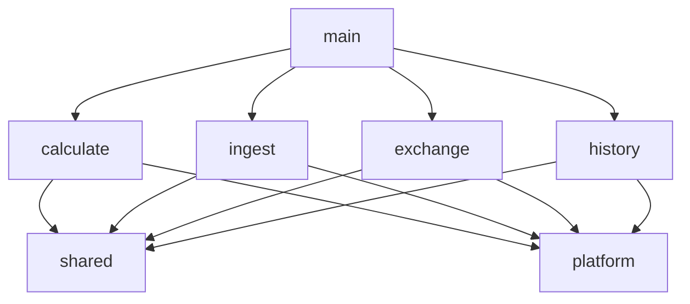

# Вариант 3. Package by feature (вертикальные срезы) + DDD

Документ для обсуждения. Постановки задач он не меняет. Сравнение с другими вариантами: [трёхслойная](01-three-layer.md), [гексагональная](02-hexagonal.md).

## Идея

Код группируется по **возможностям продукта**, а не по техническим слоям. Каждая фича хранит у себя всё своё: модель, сценарий, CLI-команду, HTTP-обработчик и специфичные адаптеры. Общее, что действительно разделяется между фичами, вынесено в **shared kernel**.

```text
internal/
├── calculate/   ─┐
├── ingest/       │  фичи не импортируют друг друга
├── exchange/     │
├── history/     ─┘
├── shared/         shared kernel: деньги, модель курса, архив снимков
└── platform/       техника: config, logging, CLI-роутер, HTTP-сервер
```

## DDD в этом варианте

Фичи соответствуют поддоменам (subdomain) единого контекста «курсы валют»:

| Фича | Поддомен | Своя модель | Команды / эндпоинты |
|---|---|---|---|
| `calculate` | ручной расчёт | — (использует `money`) | `calculate` |
| `ingest` | сбор курсов | `Provider`, `SourceResult`, backoff | `import` |
| `exchange` | выбор предложения | `Offer`, `Direction`, `Filter`, политика выбора | `convert`, `/v1/convert`, `/v1/rates/best` |
| `history` | дневная аналитика | `Day`, `DailyAverage` (агрегат), `GroupKey` | `aggregate-day`, `/v1/rates/history` |

Shared kernel: это то, о чём фичи договорились и что меняется только согласованно.

- `shared/money`: `Currency`, `Amount`, `Rate`, `Pair`;
- `shared/rate`: `Quote`, `Snapshot` (агрегат), `SourceID`, `Kind`, `Channel`, `City`, `Key`;
- `shared/archive`: хранилище снимков. `ingest` пишет в него, `exchange` и `history` читают.

Внутри фичи файлы разделены по ролям DDD: модель, сценарий, порты, адаптеры. Когда фича разрастается, её можно разложить по подпакетам `domain/`, `app/`, `adapters/` (мини-гексагон внутри фичи). Структура остальных фич от этого не меняется.

## Итоговая структура (после задачи 006)

```text
tanya-solution/
├── cmd/currency-service/
│   └── main.go                     # сборка фич и регистрация их команд и маршрутов
├── internal/
│   ├── shared/                     # SHARED KERNEL
│   │   ├── money/
│   │   │   ├── currency.go
│   │   │   ├── amount.go
│   │   │   ├── rate.go
│   │   │   ├── pair.go
│   │   │   └── parse.go
│   │   ├── rate/
│   │   │   ├── quote.go            # инварианты kind/buy/sell/reference
│   │   │   ├── snapshot.go
│   │   │   ├── source_id.go
│   │   │   ├── kind.go
│   │   │   ├── channel.go
│   │   │   ├── city.go
│   │   │   └── key.go
│   │   └── archive/                # репозиторий агрегата Snapshot
│   │       ├── atomic.go
│   │       ├── writer.go           # Save(Snapshot)
│   │       └── reader.go           # Since(t), ForDay(day)
│   │
│   ├── calculate/                  # ФИЧА 001
│   │   ├── calculate.go            # сценарий: Amount × Rate
│   │   ├── cli.go                  # команда calculate
│   │   └── calculate_test.go
│   │
│   ├── ingest/                     # ФИЧА 003–004
│   │   ├── provider.go             # порт Provider: ID(), Fetch(ctx) ([]rate.Quote, error)
│   │   ├── service.go              # ImportRates → []SourceResult
│   │   ├── result.go
│   │   ├── backoff.go              # порт BackoffStore + правило Retry-After
│   │   ├── backoff_file.go         # data/backoff/<source>.txt
│   │   ├── cli.go                  # команда import [--input], логирование результатов
│   │   ├── service_test.go
│   │   └── providers/              # адаптеры источников
│   │       ├── registry.go         # SOURCES: ID → конструктор
│   │       ├── transport.go        # HTTP 5 с / файл, HTTPError{Status, RetryAfter}
│   │       ├── cbr_xml.go
│   │       ├── cbr_json.go
│   │       ├── moex.go
│   │       ├── tbank.go
│   │       ├── raiffeisen.go
│   │       └── testdata/
│   │
│   ├── exchange/                   # ФИЧА 004–005
│   │   ├── offer.go                # Offer, Direction (buy или 1/sell)
│   │   ├── filter.go               # город, канал, банк, свежесть
│   │   ├── selection.go            # доменный сервис: LatestByKey → фильтр → сортировка
│   │   ├── service.go              # Convert, Best
│   │   ├── quotes.go               # порт QuoteReader (реализует shared/archive)
│   │   ├── errors.go               # ErrNoOffer, ErrInvalidInput
│   │   ├── cli.go                  # команда convert
│   │   ├── http.go                 # GET /v1/convert, GET /v1/rates/best
│   │   └── selection_test.go
│   │
│   ├── history/                    # ФИЧА 006
│   │   ├── day.go                  # Day Europe/Moscow, IsClosed
│   │   ├── daily_average.go        # агрегат
│   │   ├── aggregate.go            # чистая функция группировки и среднего
│   │   ├── service.go              # AggregateDay, History
│   │   ├── store.go                # порт DailyStore
│   │   ├── daily_csv.go            # data/daily/YYYY-MM-DD.csv
│   │   ├── cli.go                  # команда aggregate-day [--date]
│   │   ├── http.go                 # GET /v1/rates/history
│   │   └── aggregate_test.go
│   │
│   └── platform/                   # техника, общая для всех фич
│       ├── config/config.go        # DATA_DIR, SOURCES, LOG_LEVEL, HTTP_ADDR
│       ├── logging/logger.go
│       ├── cli/router.go           # фичи регистрируют свои команды
│       └── httpserver/
│           ├── server.go           # ServeMux, фичи регистрируют маршруты
│           ├── health.go           # GET /healthz
│           └── errors.go           # общий ответ 500 + один ERROR
├── data/                           # в .gitignore
│   ├── archive/
│   ├── daily/
│   └── backoff/
├── data-demo/                      # в .gitignore
├── crontab.example
└── README.md
```

## Зависимости



Правила:

- Фичи не импортируют друг друга. Если фиче нужно чужое, это кандидат в `shared` или повод для порта.
- `shared` не импортирует фичи и `platform/cli`, `platform/httpserver`.
- В `shared` попадает только то, что нужно минимум двум фичам. Удобство «на всякий случай» не причина.
- Логирование ошибок выполняется один раз, в `cli.go` или `http.go` своей фичи; сценарии возвращают ошибки и отчёты.
- Внутри фичи сценарий зависит от порта (`Provider`, `QuoteReader`, `DailyStore`), а не от конкретного адаптера.

## Ключевые решения

**Фича сама регистрирует свои входы:**

```go
// exchange/http.go
func (h Handlers) Register(mux *http.ServeMux) {
	mux.HandleFunc("GET /v1/convert", h.convert)
	mux.HandleFunc("GET /v1/rates/best", h.best)
}

// cmd/currency-service/main.go
store := archive.New(cfg.DataDir)
ex := exchange.NewService(store, time.Now)
srv := httpserver.New(cfg.HTTPAddr, log)
exchange.Handlers{Svc: ex, Log: log}.Register(srv.Mux())
history.Handlers{Svc: hs, Log: log}.Register(srv.Mux())
```

**Порт объявляет фича-потребитель, реализует shared:**

```go
// exchange/quotes.go
type QuoteReader interface {
	Since(ctx context.Context, t time.Time) ([]rate.Quote, error)
}
// *archive.Store удовлетворяет этому интерфейсу без импорта exchange
```

## Типовые изменения

| Изменение | Что затрагивается |
|---|---|
| Новый источник | `ingest/providers/<name>.go`, `testdata/`, строка в `registry.go` |
| Новая фича (например, уведомления о курсе) | новая папка `internal/alerts/` + регистрация в `main.go` |
| Новое правило выбора | только `exchange/selection.go` |
| Новая аналитика | только `history/` |
| Хранилище вместо CSV | `shared/archive` (+ `history/daily_csv.go`); фичи при этом не меняются, пока сохраняются порты |

## Состояние после задачи 004

Есть фичи `calculate`, `ingest` (5 источников, Retry-After, `--input`) и `exchange` только с CLI. HTTP-сервера и `history` ещё нет.

```text
tanya-solution/
├── cmd/currency-service/main.go
├── internal/
│   ├── shared/
│   │   ├── money/
│   │   │   ├── currency.go
│   │   │   ├── amount.go
│   │   │   ├── rate.go
│   │   │   ├── pair.go
│   │   │   └── parse.go
│   │   ├── rate/
│   │   │   ├── quote.go
│   │   │   ├── snapshot.go
│   │   │   ├── source_id.go
│   │   │   ├── kind.go
│   │   │   ├── channel.go
│   │   │   ├── city.go
│   │   │   └── key.go
│   │   └── archive/
│   │       ├── atomic.go
│   │       ├── writer.go
│   │       └── reader.go           # Since(t) для exchange
│   ├── calculate/
│   │   ├── calculate.go
│   │   ├── cli.go
│   │   └── calculate_test.go
│   ├── ingest/
│   │   ├── provider.go
│   │   ├── service.go
│   │   ├── result.go
│   │   ├── backoff.go
│   │   ├── backoff_file.go
│   │   ├── cli.go
│   │   ├── service_test.go
│   │   └── providers/
│   │       ├── registry.go
│   │       ├── transport.go
│   │       ├── cbr_xml.go
│   │       ├── cbr_json.go
│   │       ├── moex.go
│   │       ├── tbank.go
│   │       ├── raiffeisen.go
│   │       └── testdata/
│   ├── exchange/
│   │   ├── offer.go
│   │   ├── filter.go
│   │   ├── selection.go
│   │   ├── service.go
│   │   ├── quotes.go
│   │   ├── errors.go
│   │   ├── cli.go                  # convert --from --to --amount --channel [--city Moscow]
│   │   └── selection_test.go
│   └── platform/
│       ├── config/config.go        # DATA_DIR, SOURCES, LOG_LEVEL
│       ├── logging/logger.go
│       └── cli/router.go
├── data/archive/
└── data-demo/archive/              # demo-cbr, demo-bank-a, demo-bank-b
```

Ещё не появились: `exchange/http.go`, `internal/history/`, `platform/httpserver/`, `shared/archive.ForDay`, `data/daily/`, `crontab.example`.

### Переезд из текущего `main`

| Сейчас | После 004 |
|---|---|
| `cmd/currency-service/main.go` | `main.go` (сборка) + `platform/cli/router.go` + `*/cli.go` фич |
| `internal/domain/conversion.go` | `shared/money/*` + `calculate/calculate.go` |
| `RateRecord` в `internal/importer` | `shared/rate/quote.go` |
| `internal/importer/importer.go` | `ingest/service.go` + `ingest/provider.go` |
| нормализация ЦБ в importer | `ingest/providers/cbr_xml.go` |
| `internal/source/cbr_xml.go` | `ingest/providers/cbr_xml.go` + `transport.go` |
| `internal/archive/csv.go` | `shared/archive/writer.go` + `atomic.go` |
| `internal/config`, `internal/logging` | `platform/config`, `platform/logging` |

## Плюсы и минусы

- Всё, что относится к одной возможности, лежит в одной папке. Задача 004 почти целиком живёт в `exchange/` и `ingest/providers/`.
- Фичи можно развивать, тестировать и удалять независимо; границы для будущего разделения на сервисы уже видны.
- Хорошо ложится на поддомены DDD.
- Нужна дисциплина с `shared`: если класть туда всё подряд, он превращается в скрытый общий слой.
- Технические правила (формат ошибок HTTP, логирование) приходится держать единообразными между фичами через `platform`.
